## 0 微调概述

> - [大模型参数高效微调技术原理综述](https://zhuanlan.zhihu.com/p/635152813)

两个目标

- 微调：从过去到现在
- 微调：单模态和多模态有没有区别

### 0.1 高效参数微调

以BERT模型为代表，预训练语言模型+下游任务上进行全量微调，但以GPT3为代表的预训练语言模型（PLM）参数规模变得越来越大，这使得在消费级硬件上进行全量微调变得不可行，另一方面，全量微调方法在大模型上运用还会损失多样性，存在灾难性遗忘的问题，因此提出了高效参数微调方法。

可以粗略分为以下三大类：

- 增加额外参数（A）：在增加额外参数这类方法中，又主要分为类适配器（Adapter-like）方法和软提示（Soft prompts）两个小类
- 选取一部分参数更新（S）
- 引入重参数化（R）

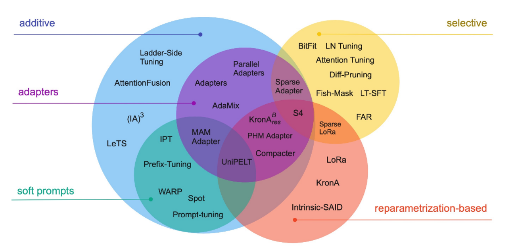

### 0.2 BitFit、Prefix Tuning、Prompt Tuning

#### BitFit（2021）

- 背景：
  - 对每个任务进行全量微调非常有效，但它也会为每个预训练任务生成一个独特的大型模型，这使得很难推断微调过程中发生了什么变化，也很难部署， 特别是随着任务数量的增加，很难维护
  - 希望
    - 仅更改一小部分模型参数，能够匹配全量微调的效果
    - 改变的参数在不同下游任务中是一致的
- 是一种稀疏的微调方法，它训练时只更新bias的参数或者部分bias参数
- 对于Transformer模型而言，冻结大部分 transformer-encoder 参数，只更新bias参数跟特定任务的分类层参数；涉及到的bias参数有attention模块中计算query,key,value跟合并多个attention结果时涉及到的bias，MLP层中的bias，Layer normalization层的bias参数
- 消融实验：通过对比BitFit训练前后的参数，发现很多bias参数并没有太多变化（例如：跟计算key所涉及到的bias参数）。发现计算query和将特征维度从N放大到4N的FFN层（intermediate）的bias参数变化最为明显，只更新这两类bias参数也能达到不错的效果，反之，固定其中任何一者，模型的效果都有较大损失

#### Soft prompts

**Prefix Tuning**

- 背景
  - 之前的工作主要是人工设计离散的模版或者自动化搜索离散的模版，难以达到最优，且模版的变化对模型最终的性能特别敏感
  - 传统的微调范式对每个任务都要保存一份微调后的模型权重，一方面微调整个模型耗时长；另一方面也会占很多存储空间
- 提出固定预训练LM，为LM添加可训练，任务特定的前缀，这样就可以为不同任务保存不同的前缀，微调成本也小；同时，这种Prefix实际就是连续可微的Virtual Token（Soft Prompt/Continuous Prompt），相比离散的Token，更好优化，效果更好
- 在每层都加了prompt的参数，改动较大
- 针对不同的模型结构，需要构造不同的Prefix
  - 针对自回归架构模型：在句子前面添加前缀，得到 `z = [PREFIX; x; y]`，合适的上文能够在固定 LM 的情况下去引导生成下文（比如：GPT3的上下文学习）
  - 针对编码器-解码器架构模型：Encoder和Decoder都增加了前缀，得到 `z = [PREFIX; x; PREFIX0; y]`。Encoder端增加前缀是为了引导输入部分的编码，Decoder 端增加前缀是为了引导后续token的生成

**Prompt Tuning**

- 背景类似**Prefix Tuning**
  - 全量微调开销和部署成本都比较高
  - 离散的prompts方法，成本比较高，并且效果不太好
- 可以看作是Prefix Tuning的简化版本，它给每个任务定义了自己的Prompt，然后拼接到数据上作为输入，但**只在输入层加入prompt tokens**，并且不需要加入 MLP 进行调整来解决难训练的问题
- 还提出了 Prompt Ensembling，也就是在一个批次（Batch）里同时训练同一个任务的不同 prompt，相当于训练了不同模型

#### P-Tuning、P-Tuning v2

**P-Tuning**

- 背景
  - 大模型的Prompt构造方式严重影响下游任务的效果
    - 比如：GPT-3采用人工构造的模版来做上下文学习（in context learning），但人工设计的模版的变化特别敏感，加一个词或者少一个词，或者变动位置都会造成比较大的变化
  - 自动化搜索模版工作成本也比较高，以前这种离散化的token的搜索出来的结果可能并不是最优的，导致性能不稳定
- 将Prompt转换为可以学习的Embedding层，并用MLP+LSTM的方式来对Prompt Embedding进行一层处理
- 相比Prefix Tuning，P-Tuning加入的可微的virtual token，但仅限于输入层，没有在每一层都加
- 另外，virtual token的位置也不一定是前缀，插入的位置是可选的。这里的出发点实际是把传统人工设计模版中的真实token替换成可微的virtual token

**P-Tuning v2**

- 背景：Prompt Tuning和P-Tuning等方法存在两个主要的问题

  - 缺乏模型参数规模和任务通用性

    - 缺乏规模通用性：Prompt Tuning表明当模型规模超过100亿个参数时，提示优化可以与全量微调相媲美。但是对于那些较小的模型（从100M到1B），提示优化和全量微调的表现有很大差异
    - 缺乏任务普遍性：尽管Prompt Tuning和P-tuning在一些 NLU 基准测试中表现出优势，但提示调优对硬序列标记任务（即序列标注）的有效性尚未得到验证
  - 缺少深度提示优化

    - 在Prompt Tuning和P-tuning中，连续提示只被插入transformer第一层的输入embedding序列中，导致
      - 可调参数的数量是有限的
      - 输入embedding对模型预测只有相对间接的影响
- 在每一层都加入了Prompts tokens作为输入，而不是仅仅加在输入层

  - 更多可学习的参数（从P-tuning和Prompt Tuning的0.01%增加到0.1%-3%），同时也足够参数高效
  - 加入到更深层结构中的Prompt能给模型预测带来更直接的影响
- 具体做法基本同Prefix Tuning，将文本生成的Prefix Tuning技术适配到NLU任务中，然后做了一些改进

  - **移除重参数化的编码器**：如：Prefix Tuning中的MLP、P-Tuning中的LSTM
  - **针对不同任务采用不同的提示长度**
  - **引入多任务学习**：先在多任务的Prompt上进行预训练，然后再适配下游任务
  - **回归传统的分类标签范式，而不是映射器（Verbalizer）**：P-Tuning v2回归传统的CLS标签分类范式，采用随机初始化的分类头（Classification Head）应用于tokens之上，以增强通用性，可以适配到序列标注任务
- P-Tuning v2从330M到10B的模型显示出一致的改进
- 可以简单的将P-Tuning认为是针对Prompt Tuning的改进，P-Tuning v2认为是针对Prefix Tuning的改进

#### Adapter Tuning及其变体

**Adapter Tuning**（2019）

- 在预训练模型每层中插入用于下游任务的参数（针对每个下游任务，仅增加3.6%的参数），在微调时将模型主体冻结，仅训练特定于任务的参数，从而减少了训练时的算力开销
- 设计了Adapter结构，并将其嵌入Transformer的结构里面，针对每一个Transformer层，增加了两个Adapter结构(分别是多头注意力的投影之后和第二个feed-forward层之后)，在训练时，固定住原来预训练模型的参数不变，只对新增的 Adapter 结构和 Layer Norm 层进行微调，从而保证了训练的高效性
- 每当出现新的下游任务，通过添加Adapter模块来产生一个易于扩展的下游模型，从而避免全量微调与灾难性遗忘的问题
- 通过在Transformer层中嵌入Adapter结构，**在推理时会额外增加推理时长**。

**AdapterFusion**（可能可以优化）

- 背景：整合来自多个任务的知识，传统方法
  - 按一定顺序微调（Sequential fine-tuning）：需要先验知识来确定顺序，且模型容易遗忘之前任务学到的知识
  - 多任务学习（multi-task learning）：不同的任务会互相影响，也难以平衡数据集大小差距很大的任务
- 一种融合多任务信息的Adapter的变体，在 Adapter 的基础上进行优化，通过将学习过程分为**两阶段**来提升下游任务表现
  - 知识提取阶段：在不同任务下引入各自的Adapter模块，用于学习特定任务的信息
  - 知识组合阶段：将预训练模型参数与特定于任务的Adapter参数固定，引入新参数（AdapterFusion）来学习组合多个Adapter中的知识，以提高模型在目标任务中的表现
- 第一阶段采用ST-A+第二阶段AdapterFusion是最有效的方法

**AdapterDrop**

- 背景：Adapter的计算效率优化
  - 通过对Adapter的计算效率进行分析，发现与全量微调相比，Adapter在训练时快60%，但是在推理时慢4%-6%
- 在不影响任务性能的情况下，对Adapter动态高效的移除，尽可能的减少模型的参数量，提高模型在反向传播（训练）和正向传播（推理）时的效率
- 实验表明，从较低的 Transformer 层中删除Adapter可以显着提高多任务设置中的推理速度。 例如，将前五个Transformer层中的Adapter丢弃，在对 8 个任务进行推理时，速度提高了 39%。并且即使有多个丢弃层，AdapterDrop 也能保持良好的结果

#### LoRA、AdaLoRA、QLoRA

**LoRA**

- 核心思想：通过低秩分解来模拟参数的改变量
- 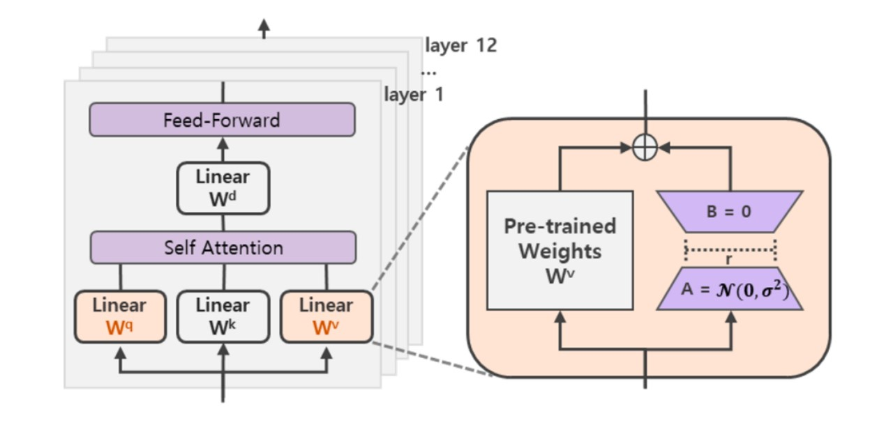
- 技术原理：
  - 在涉及到矩阵相乘的模块，在原始的PLM旁边增加一个新的通路，通过前后两个矩阵A,B相乘，第一个矩阵A负责降维，第二个矩阵B负责升维，中间层维度为r，从而来模拟所谓的本征秩（intrinsic rank）
  - r<<d，r是矩阵的秩，这样矩阵计算就从d x d变为d x r + r x d
  - 在下游任务训练时，固定模型的其他参数，只优化新增的两个矩阵的权重参数，将PLM跟新增的通路两部分的结果加起来作为最终的结果
  - Transformer的权重矩阵包括Attention模块里用于计算query, key, value的Wq，Wk，Wv以及多头attention的Wo,以及MLP层的权重矩阵，LoRA只应用于Attention模块中的4种权重矩阵，而且通过消融实验发现同时调整 Wq 和 Wv 会产生最佳结果
- 相较其他方法**消除了推理延迟**（因为是将BA加到W上）
- 可以通过可插拔的形式切换到不同的任务
- 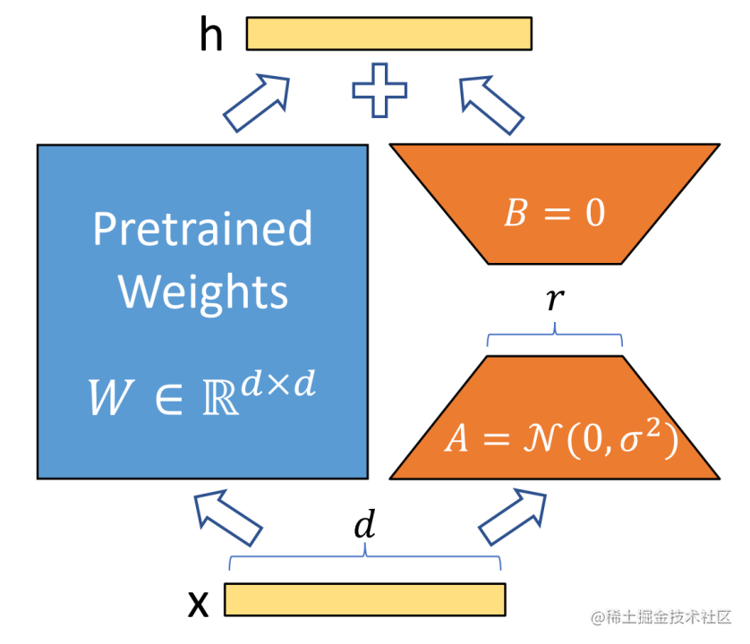

**AdaLoRA**

- 背景：减少微调参数的数量，同时保持甚至提高预训练语言模型的性能
  - **方向一：添加小型网络模块**
    - Adapter tuning、Prefix tuning、Prompt Tuning等，大大减少了内存消耗
    - 存在问题：Adapter tuning引入了推理延时；Prefix tuning或Prompt tuning直接优化Prefix和Prompt是非单调的，比较难收敛，并且消耗了输入的token
  - **方向二：下游任务增量更新**
    - 对预训练权重的增量更新进行建模，而无需修改模型架构，如：Diff pruning、LoRA等
    - 存在问题：
      - Diff pruning需要底层实现来加速非结构化稀疏矩阵的计算，不能直接使用现有的框架，训练过程中需要存储完整的∆W矩阵，相比于全量微调并没有降低计算成本
      - LoRA则需要预先指定每个增量矩阵的本征秩r，忽略了在微调预训练模型时，权重矩阵的重要性在不同模块和层之间存在显著差异；并且只训练了Attention，没有训练FFN，事实上FFN更重要
- **原理**：对LoRA的一种改进，它根据重要性评分动态分配参数预算给权重矩阵
  - **调整增量矩分配**：将关键的增量矩阵分配高秩以捕捉更精细和任务特定的信息，将较不重要的矩阵的秩降低，以防止过拟合并节省计算预算
  - **以奇异值分解的形式对增量更新进行参数化，并根据重要性指标裁剪掉不重要的奇异值，同时保留奇异向量**
  - **在训练损失中添加了额外的惩罚项**，规范奇异矩阵P和Q的正交性

**QLoRA**

- 背景：主要是**量化**微调的角度减少了显存占用
  - 微调大模型非常昂贵，以LLaMA参数模型为例，16 bit微调需要超过780GB的GPU内存
- **技术原理**
  - 包含一种低精度存储数据类型（通常为4-bit）和一种计算数据类型（通常为BFloat16）
  - 将预训练模型量化为 4 bit，然后添加一小组可学习的低秩适配器权重进行微调
    - 提出了两种技术实现高保真4bit微调
      - **4bit NormalFloat**（NF4）
      - **双量化**：对第一次量化后的那些常量再进行一次量化，减少存储空间
    - **分页优化器**：使用NVIDIA统一内存特性，该特性可以在GPU偶尔OOM的情况下，进行CPU和GPU之间自动分页到分页的传输，以实现无错误的 GPU 处理
  - 在实践中，QLoRA权重张量使用时，需要将低比特张量去量化为BFloat16，然后在16位计算精度下进行矩阵乘法运算

#### MAM Adapter、UniPELT

==**MAM Adapter**==

- 背景
  - 探讨多种微调方法之间的联系，如Adapter，Prefix Tuning和LoRA
  - 将它们重新构建为对预训练模型中特定隐藏状态的修改
- 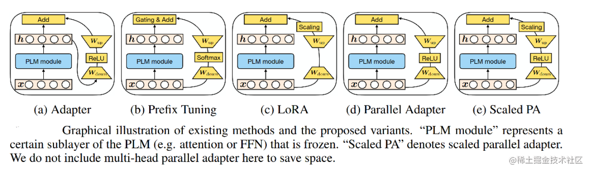
- 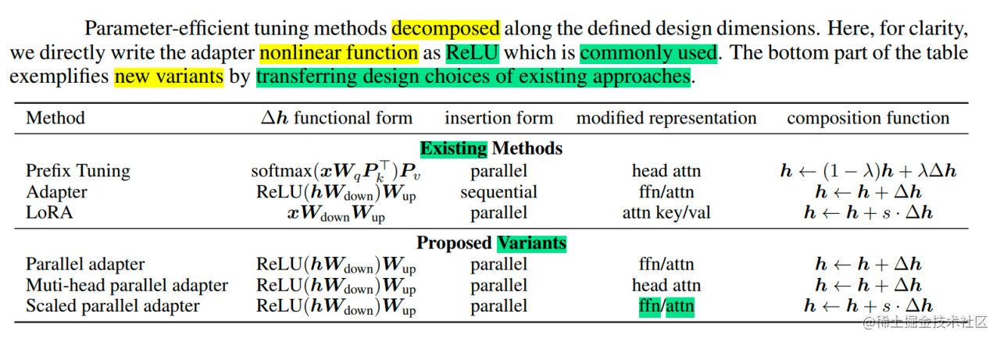
- **具体实现**
  - 并行放置的Adapter优于顺序放置的Adapter，并且与 FFN 并行放置的Adapter优于多头注意力（MHA）并行放置的Adapter
  - 软提示可以通过仅更改 0.1% 的参数来有效地修改注意力
  - 最终模型 MAM Adapter 是用 FFN 层的并行Adapter和软提示的组合

**UniPELT**

- 背景
  - 针对语言模型的参数高效微调方法众多，不同的PELT方法在同一个任务上表现差异可能都非常大，让针对特定任务选择合适的方法非常繁琐
  - 提出了UniPELT方法，将不同的PELT方法作为子模块，并通过门控机制学习激活最适合当前数据或任务的方法（有点类似MoE）
- **技术原理**
  - 门控组合
    - LoRA 重新参数化用于 WQ 和 WV 注意力矩阵
    - Prefix Tuning应用于每一Transformer层的key和value
    - 并在Transformer块的feed-forward子层之后添加Adapter
  - 门控被实现为线性层
  - 可训练参数包括 LoRA 矩阵 WA（Down）和WB（Up），提示调优参数Pk和Pv、Adapter参数和门函数权重
  - 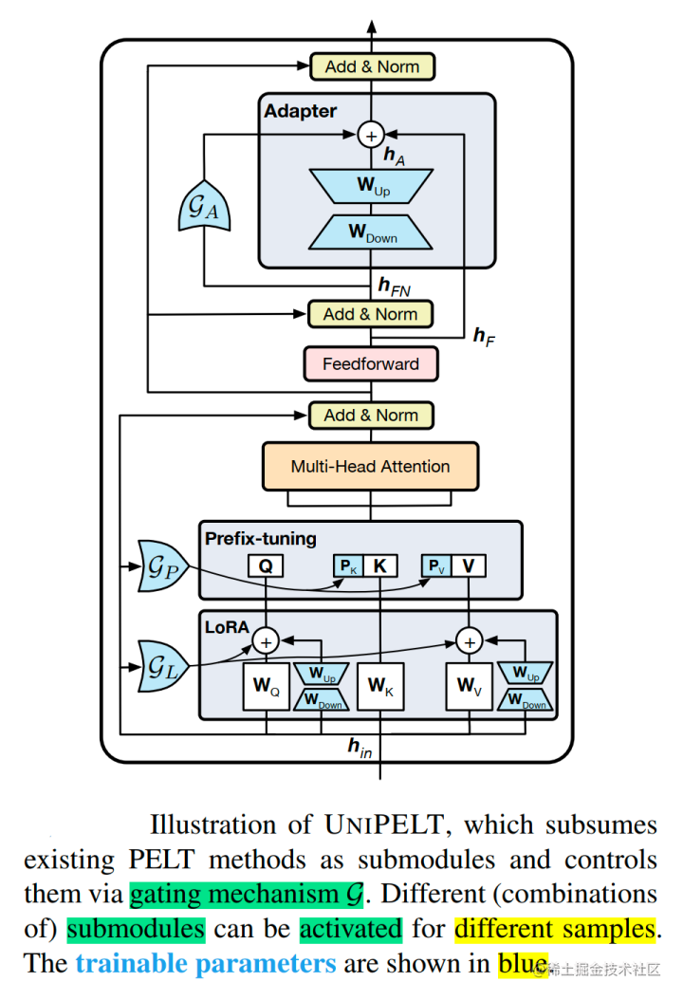
- 对不同 PELT 方法训练时间和推理时间进行了分析
  - 从训练速度来看，UniPELT比之前微调的方法多一些，但是还在能接受的范围
  - 从推理时间来看，BitFit方法增加的最少，UniPELT方法时间增加了27%
  - 从训练参数量来看，LoRA，BitFit，Prefix-tuning都比较小，UniPELT参数量相对会多一些
  - 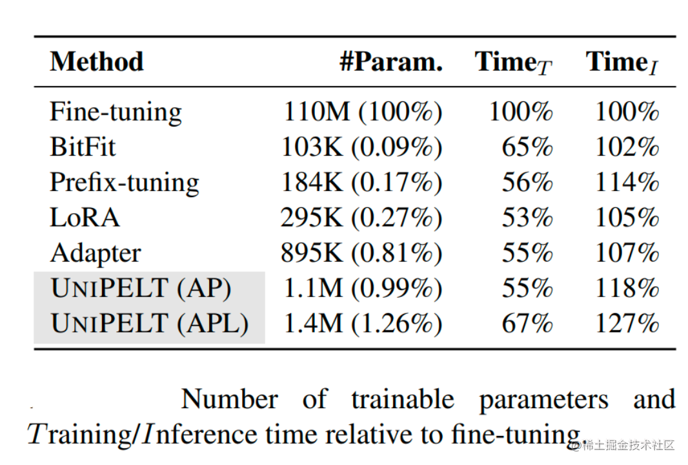

#### 总结

总的来说，像P-Tuning v2、LoRA等都是综合评估很不错的高效微调技术。如果显存资源有限可以考虑QLoRA；如果只是解决一些简单任务场景，可以考虑P-Tuning、Prompt Tuning也行。

下表从参数高效方法类型、是否存储高效和内存高效、以及在减少反向传播成本和推理开销的计算高效五个维度比较了参数高效微调方法。

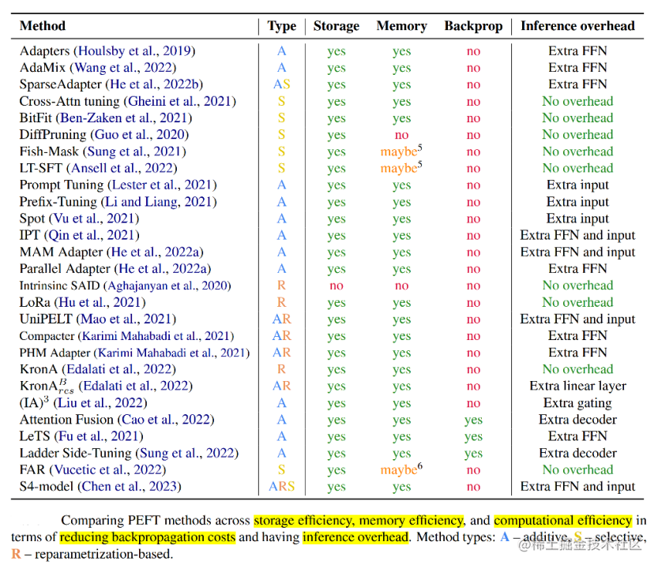

下表展示了各种参数高效方法的参与训练的参数量、最终模型与原始模型的改变参数（delta值）以及论文中参与评估的模型的范围（<1B、<20B、>20B）。

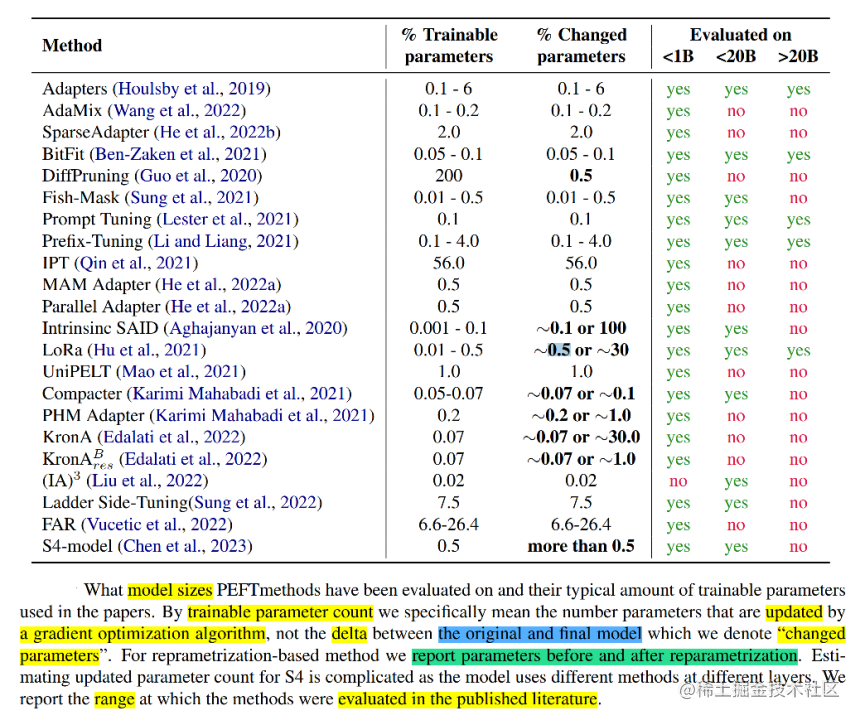

从表中可以看到，Prompt Tuning、Prefix Tuning、LoRA等少部分微调技术针对不同参数规模的模型进行过评估，同时，这几种方式也是目前应用比较多的高效微调方法。

## 0.5 数学基础补充

**低秩分解**

- 用U*V来逼近M，M是m\*n的矩阵，U是m\*r，V是r\*n，其中r是人工指定的参数——LoRA
- 奇异值（SVD）分解：AdaLoRA
- CP 分解( Canonical Polyadic Decomposition (CPD)：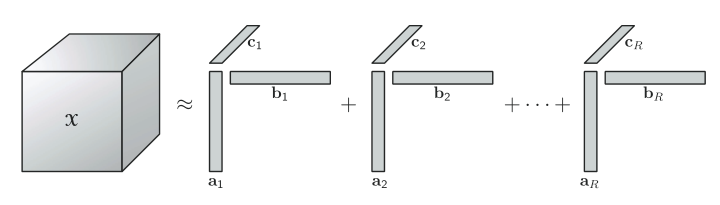
- **Tucker分解**：计算复杂度比较大
  - 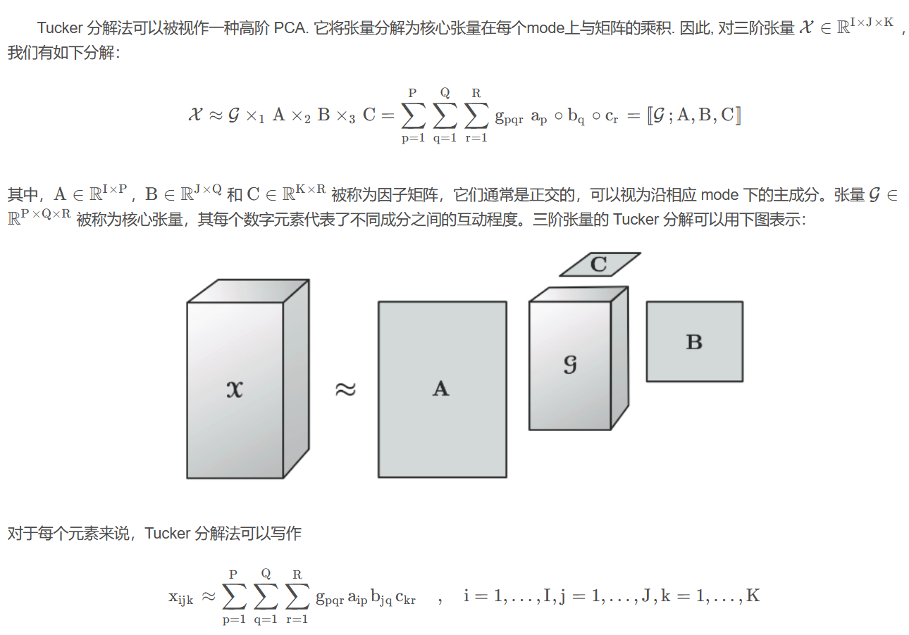

## 1 多模态基础大模型高效微调

> - [NeurIPS&#39;23|多模态基础大模型的高效微调](https://zhuanlan.zhihu.com/p/664394525)
> - https://github.com/WillDreamer/Aurora

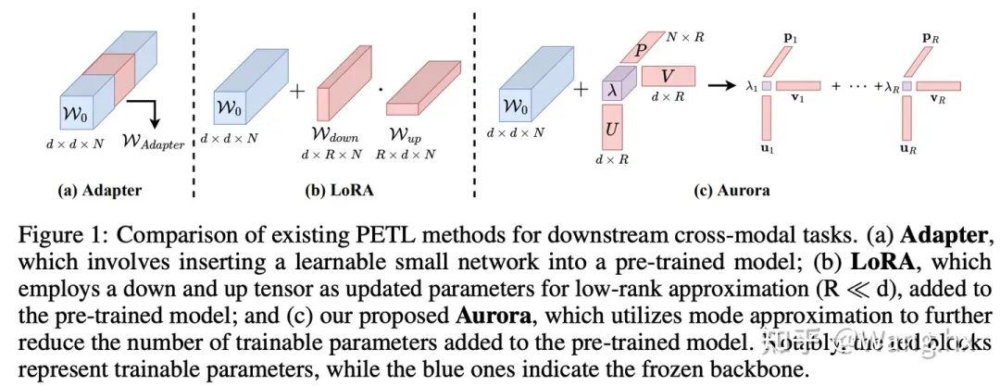

- Aurora
- 采用模式近似（mode apprximation）的方法来进行大模型的轻量化高效微调，仅需训练预训练大模型0.04%的参数
- 架构原理：CP分解（秩为R）
  - 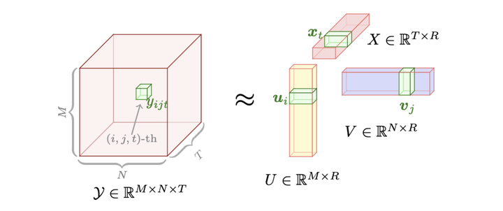
  - 为多模态基础大模型中每个模态分支中的每个权重矩阵初始化可学习的mode factors（**U、V**和**P**）和可学习的系数向量λ。其中**U**和**P**是随机初始化的，而**V**被设置为零。mode factors在全局共享，可以实现权重矩阵之间的跨模态交互和知识共享
- 启发性模块：增强模态对齐
  - **Informative Context Enhancement**
    - 在交叉注意力模块后进行特征融合时，引入上下文增强模块，提供提示文本来更好的激活
  - **Gated Query Transformation**
    - 解决多模态融合分支网络较深导致的训练过程中的文本信息消失造成的多模态信息难以对齐
    - 类似于残差连接，只不过是学习一个gated query函数来平衡两种模态的贡献
- 实验结果
  - 图文检索
    - 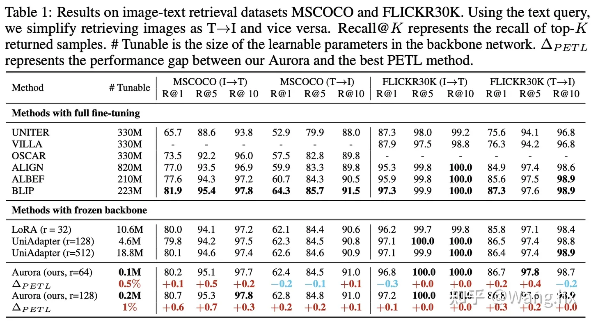
  - 视频文本检索
    - 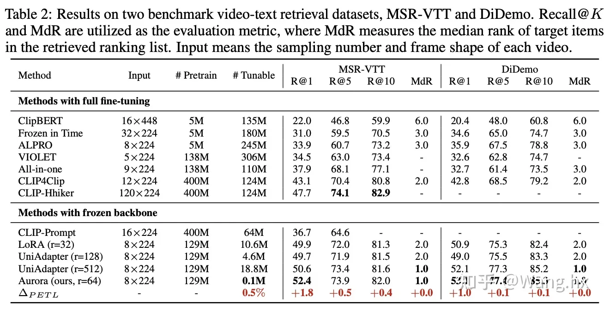
  - VQA
    - 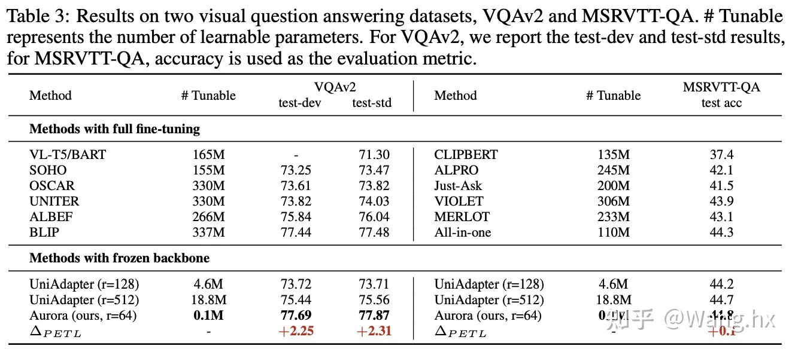

## 2 多模态大模型编辑

> - EMNLP2023
> - https://arxiv.org/abs/2310.08475
> - https://github.com/zjunlp/EasyEdit

- 背景
  - 解决模型幻觉问题的新思路
  - 现有的模型编辑技术大部分都是针对单模态的，探究编辑多模态大语言模型的可行性
- 评估数据集的构建
  - 可靠性（Reliability）
    - 收集了现有多模态大语言模型表现不佳的任务数据来作为编辑对象数据集
    - 设计两种任务编辑数据集E-VQA和E-IC
  - 泛化性（Generality）
    - 文本数据：
      - VQA数据：使用ChatGLM去生成文本类的泛化数据集，通过构造相关的prompt生成相似句子
      - Image Caption任务：数据比较简单，生成效果并不佳；人工构建了几十条相似文本数据，然后通过随机替换的方式作为Image Caption任务的泛化数据集
    - 图片数据：
      - 利用COCO数据集中提供的图片描述，通过Stable Diffusion 2.1来生成与图片描述相似的图片
  - 稳定性（Locality）
    - 为了考量编辑不同区域对模型的影响，所以将稳定性数据分为了Text Stability测试数据和Vision Stability测试数据
    - 使用了之前的已有数据集：MEND中的NQ数据集（文本）、问答数据集OK-VQA（多模态）
- 流程实例
  - 视觉出错
    - 在图片识别这个阶段就出错
    - 提出了Vision Edit，针对VLMs的视觉模块进行编辑
  - 知识出错
    - 正确识别了图片中的关键特征，但是本身的知识库里却没有相关特征的知识
    - 提出了Language Edit，由于多模态语言模型的知识库都来自于LLMs，所以这部分编辑也就是针对语言模型
  - 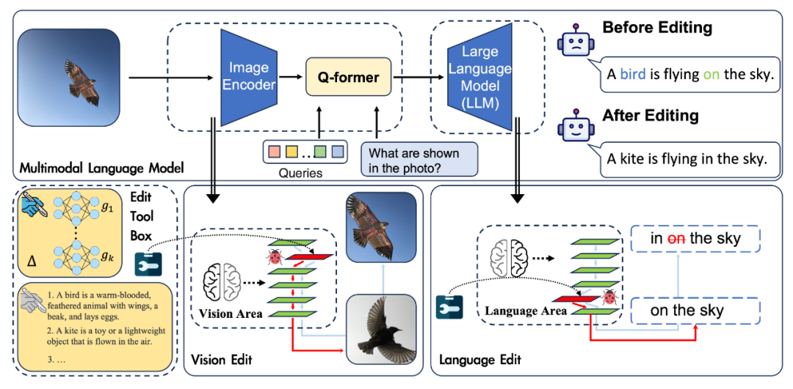
- 结果总结
  - 编辑编辑不同区域效果差异非常大：编辑视觉模块比较困难，作者觉得可能和模型的架构有关。因为编辑语言模型部分可以直接影响模型的输出，而编辑视觉部分只能影响模型输入，而且大部分的知识都是保存在LLMs中的，所以编辑视觉模块的效果不佳
- 支持模型
  - 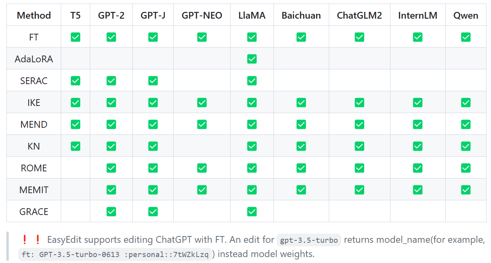

## 3 多模态大模型对比

> - Gemini技术报告
> - Gemini vs GPT-4V
> - [NExT-GPT](https://next-gpt.github.io/)

**Gemini 技术报告**

- 没有透漏具体技术细节，比如：数据量级、组织方式、配比问题，模型尺寸、Dense Or MoE 架构，训练的具体细节、Scaling 性质的研究；大部分是评测
- 训练可能分成多个阶段，最后阶段提高了领域数据的混合配比，猜测应该指的是逻辑和数学类的训练数据增加了配比
- 预训练
  - 使用了32K Context Length，对于Long Context场景更友好
  - 模型结构：Decoder only，采用高效的注意力机制（例如多查询注意力）
  - 多模态
    - 一开始就采用了集成式设计，把文本、图片、音频、视频等模态联合从头训练
    - 不同于GPT-4V使用现有不同模态的模型，进行Cross Attention之后组装到一起，而是把所有的多模态数据Tokenizer得到多模态序列后进行自回归
    - Flamingo、CoCa、PaLI
- 指令微调
  - 和GPT一样，采用多模态指令数据进行SFT+RM+RLHF三阶段
  - RM部分在训练打分模型的时候，采用了加权的多目标优化方法，三个目标helpfulness factuality、safety，对齐信号的可解释性更强
  - 参考并使用之前的 Constitutional AI来生成大规模的回答

**Gemini vs GPT-4V**

- **A Challenger to GPT-4V? Early Explorations of Gemini in Visual Expertise**

  > - https://arxiv.org/pdf/2312.12436.pdf
  > - https://github.com/BradyFU/Awesome-Multimodal-Large-Language-Models
  >   - 全面收集了MLLM进展的项目
  >
- 将Gemini Pro与GPT-4V进行了比较并与最新开源的MLLM Sphinx进行了对比
- 评估基础

  - 提示技术
    - 简单指令：直接表达用户的意图，例如“描述这张图片”或“这张海报中的人是谁？”
    - 视觉引用提示：例如尝试用物理对象（如手指或笔）作为提示，引导模型理解引用对象，在实时交互场景中更为实用
    - 思维链（CoT）提示：对于涉及复杂逻辑推理的问题，采用 CoT 技术，引导模型通过一系列逻辑思考过程给出最终答案
    - 上下文中的少示例学习：通过在推理时提供几个示例，帮助模型能从这些示例中推断意图，从而更好地生成所需输出
  - 数据集
    - 查询中的所有文本都是全新构建的
    - 图像来源包括手绘图像、离线照片、互联网图像以及一些现有数据集；互联网图像特别地收集了时间戳在 2023年11月之后的图像
- 差异

  - GPT-4V倾向于生成更详细的感知任务描述，并为认知任务提供深入分析，包括逐步中间推理；细粒度感知优势更加显著；但是会避免尝试回答某些超出知识范围的问题
  - Gemini更喜欢为答案提供直接而简洁的回应，这有助于用户快速找到相关信息
- 共同问题

  - 空间感知能力：Gemini和GPT-4V都不擅长确定物体的相对位置
  - OCR和抽象视觉理解表现不够好：误解图表中的一些数字和字符，难以理解一些几何形状和抽象的归纳能力
  - 推理中的逻辑自洽性不足：有时会提供与最终答案不一致或相反的中间推理步骤
- [1]：https://github.com/LC1332/Chinese-alpaca-lora
- [2]：https://github.com/hikariming/alpaca_chinese_dataset
- [3]：https://github.com/carbonz0/alpaca-chinese-dataset
- [4]：https://github.com/Instruction-Tuning-with-GPT-4/GPT-4-LLM
- [5]：https://github.com/LianjiaTech/BELLE
- [6]：https://huggingface.co/datasets/JosephusCheung/GuanacoDataset
